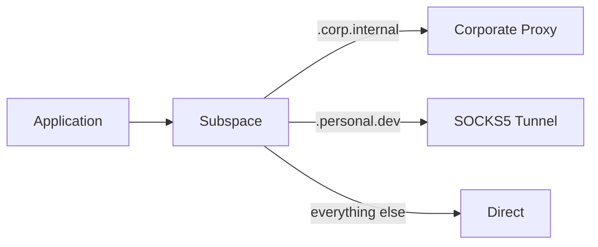

# What is Subspace?

Subspace is a transparent proxy that routes traffic through upstream proxies based on hostname and IP matching. It supports HTTP, HTTPS, WebSocket, WSS, and SOCKS5 without terminating TLS.

## The Problem

You need certain traffic to go through specific proxies — corporate traffic through a corporate proxy, personal traffic direct, internal services through a SOCKS5 tunnel. Most tools force you to choose one proxy for everything, or require per-application configuration.

## How It Works

Subspace sits between your applications and the network. When a connection arrives:

1. It **peeks at the first byte** to determine the protocol (SOCKS5, TLS, HTTP, or CONNECT)
2. It **extracts the hostname** from the SOCKS5 request, SNI extension (TLS), Host header (HTTP), or CONNECT target
3. It **matches the hostname** against your routing rules
4. It **forwards the connection** through the appropriate upstream proxy, or connects directly

For TLS traffic, Subspace never decrypts the data — it reads just enough of the ClientHello to extract the server name, then tunnels the raw bytes through the selected upstream.

## Key Features

- **HTTP, HTTPS, WebSocket, WSS** — all protocols handled transparently
- **SOCKS5 inbound** — accepts SOCKS5 clients on the same port, auto-detected alongside HTTP
- **HTTP CONNECT and SOCKS5** upstreams with optional authentication
- **Pattern matching** — exact hostnames, domain suffixes, globs, CIDR subnets
- **Connection pooling** — reuses upstream connections for HTTP requests
- **HTTP keep-alive** — multiple requests per client connection
- **Internal pages** — link dashboards and live statistics at `*.subspace.pub` hostnames, with `/` search across all pages and links
- **Hot reload** — config changes apply without restart
- **Config includes** — split config across files with glob support
- **Health checks** — TCP health checks via the status command
- **Live logs** — stream colored logs from a running server
- **Styled error pages** — DNS failures and connection errors show helpful error pages

## What Subspace Is Not

- **Not a VPN** — it's a proxy. Applications must be configured to use it (via `http_proxy` or transparent interception)
- **Not a TLS terminator** — it never decrypts your HTTPS traffic
- **Not a load balancer** — each route maps to exactly one upstream

## Platforms

Subspace runs on Linux and macOS, on both amd64 and arm64 architectures.

## Next Steps

- [Installation](/guide/installation) — install Subspace
- [Quick Start](/guide/quick-start) — get running in 2 minutes
- [Configuration](/guide/configuration) — learn the config format
