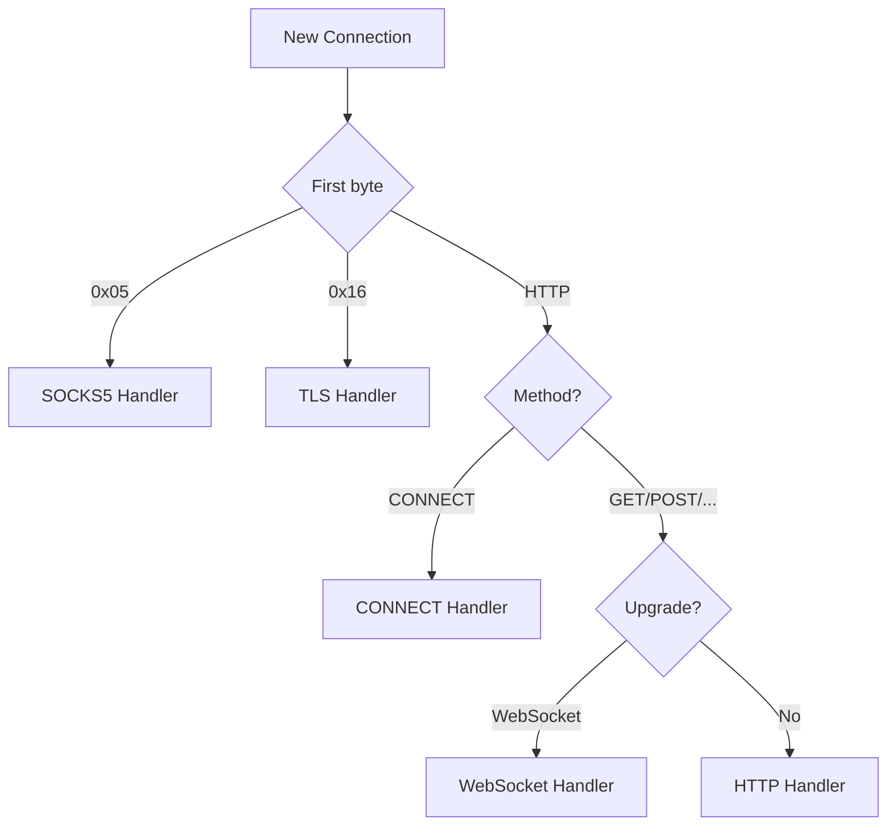

# Connection Handling

How Subspace classifies, routes, and manages connections.

## Protocol Detection

When a connection arrives, Subspace peeks at the first byte to classify it:

### SOCKS5

The SOCKS5 handler performs the server-side handshake (no-authentication only), extracts the target hostname and port from the connect request, then routes through the same upstream selection as HTTP CONNECT. After a successful dial, it enters a bidirectional relay. SOCKS5 supports IPv4, IPv6, and domain name address types.

SOCKS5 is auto-detected on the same port — no separate listener or configuration needed.

### TLS

The TLS handler reads the full ClientHello record to extract the SNI hostname. It reads the 5-byte TLS record header to determine the record length, then peeks that many bytes (up to 4 KB) for reliable SNI extraction even with large ClientHellos.

After extracting the SNI, the connection is tunneled as raw bytes — Subspace never decrypts TLS traffic.

### HTTP CONNECT

The CONNECT handler responds with `200 Connection Established`, then enters a bidirectional relay between the client and the upstream. This is the standard mechanism for HTTPS proxying.

### HTTP

The HTTP handler reads the `Host` header for routing. It supports HTTP/1.1 keep-alive — multiple requests can be served on a single client connection.

If the request contains an `Upgrade: websocket` header, the connection is handed off to the WebSocket handler, which forwards the upgrade request and enters a bidirectional relay.

## Keep-Alive

Client connections support HTTP/1.1 keep-alive by default:

- After responding to a request, the server reads the next request on the same connection
- `Connection: close` from the client closes the connection after the response
- HTTP/1.0 requests close by default (unless `Connection: keep-alive` is set)
- An idle timeout (60 seconds) closes connections with no activity

## Connection Pooling

HTTP requests reuse upstream connections when possible:

1. Before dialing a new upstream connection, the pool is checked for an idle connection to the same `(upstream, target-address)` pair
2. After a response is fully read, the upstream connection is returned to the pool if reusable
3. Connections are considered reusable when the upstream didn't signal close and no stray bytes are buffered

### Pool Parameters

| Parameter | Default | Description |
|---|---|---|
| Max idle per host | 4 | Maximum idle connections per `(upstream, address)` pair |
| Idle timeout | 90s | Connections idle longer than this are evicted |
| Eviction interval | 10s | Background sweep frequency for stale connections |

### Pool Lifecycle

- On **config reload**, the entire pool is drained (pooled connections may point to changed upstreams)
- On **Get**, a liveness check detects connections closed by the remote side
- On **Put**, excess connections beyond the per-host limit are closed
- On **shutdown**, all pooled connections are closed

Pooling applies only to HTTP requests. CONNECT, TLS, SOCKS5, and WebSocket connections use bidirectional relay and are not pooled.

## Zero-Copy Relay

For tunneled connections (TLS, CONNECT, WebSocket), Subspace unwraps the buffered peek reader before entering the relay loop. This exposes the raw `net.Conn` to `io.Copy`, allowing the kernel to use `splice(2)` or `sendfile(2)` for zero-copy data transfer between sockets.

Any bytes consumed by the peek reader during protocol detection are forwarded first, then the relay proceeds with raw connections.

## Statistics

Subspace tracks per-connection statistics:

| Metric | Scope | Description |
|---|---|---|
| Total connections | Global | Requests handled since startup |
| Active connections | Global | Currently open connections |
| Protocol counts | Global | Breakdown by SOCKS5, TLS, HTTP, CONNECT, WebSocket |
| Error counts | Global | By error type (peek_failed, parse_failed, etc.) |
| Success / Failures | Per upstream | Dial outcomes |
| Bytes in / out | Per upstream | Transfer volume |
| Pool hits / misses | Global | Connection reuse rate |
| Idle connections | Per upstream | Currently pooled connections |

Statistics are available via `subspace status`, the `/status` control socket endpoint, or the built-in statistics page at `statistics.subspace`. Historical data is persisted to a SQLite database and retained for one year with automatic downsampling.
